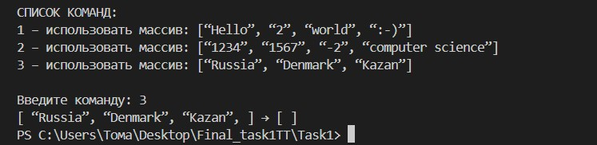
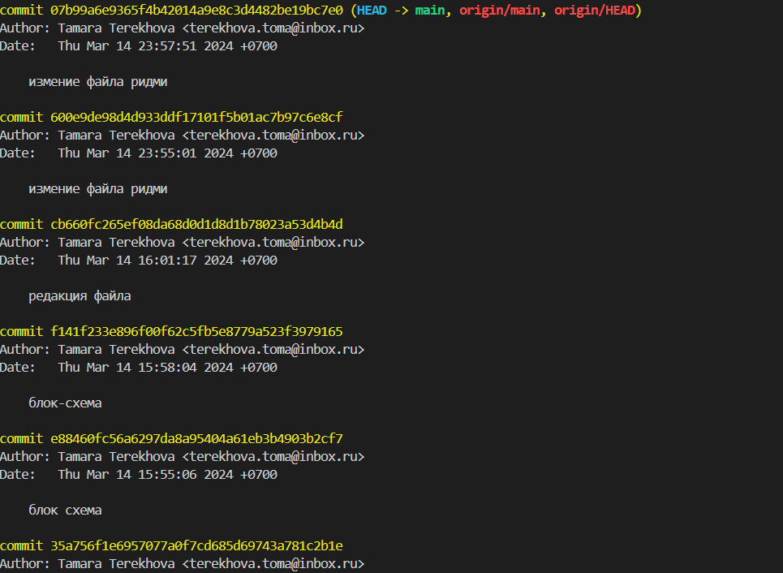

## Итоговая контрольная работа по блоку 1
# Необходимо:
1. Создать репозиторий на GitHub
2. Нарисовать блок-схему алгоритма 
3. Снабдить репозиторий оформленным текстовым описанием решения (Файл README.md)
4. Написать программу, решающую поставленную задачу 
5. Использовать контроль версию в работе над этим небольшим проектом 

## Задача :
 *Написать программу, которая из имеющегося массива строк формирует новый массив из строк, длина которых меньше, либо равна 3 символам. Первоначальный массив можно ввести с клавиатуры, либо задать на старте выполнения алгоритма. При решении не рекомендуется пользоваться коллекциями, лучше обойтись исключительно массивами*

 # Этапы для решения Итоговой работы 

 1. Создание репозитория на GitHub c использованием пустого файла Readmy 
 2. Связать локальный и удаленный репозиторий (**git oush origin main**)
 3. Заполнение файла Readme.md используемые команды (**git status, git add, git commit -m**)
 4. Создаем папку **Task1 файл Program.cs**
 5. Добавление файл .gitignore

 ## Описание функций использованных входе решения задачи:

 1. *Ввод команды с помощью функции ReadInput()*
 
 2. *Обработка команды с помощью switch-case*
 
 3. *Создание нового массива newArray с элементами, длина которых меньше или равна 3*

 4. *Вывод исходного массива array и нового массива newArray с использованием функции PrintArray()*

 5. *Определение списка доступных команд с помощью функции Commands()*

 ## *Задача находиться в ветке master*

 

## Для удобства проверки разных массивов в программе, была применена switch, функции ввода/вывода в консоль.
**Они не указаны в блок-схеме**

## Вывод в консоль задачи, напоминаю она находится в ветке master 

## Вывод коммитов 
